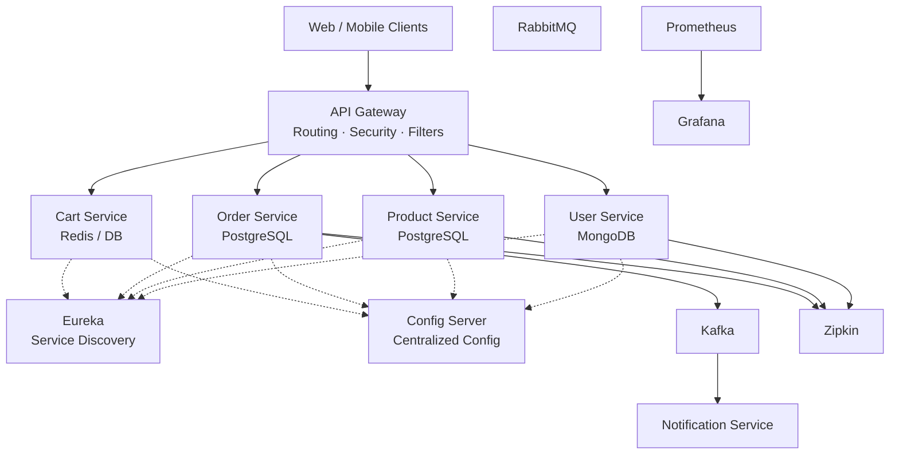

  <h1 style="font-size:42px; font-weight:800; margin-bottom:8px;">
    Ecommerce Microservices Backend Platform
  </h1>

  

    A production-style <b>Spring Boot microservices backend</b> for an Ecommerce platform, designed using real-world architecture patterns such as service discovery, centralized configuration, event-driven communication, observability, and containerized deployment.
  

  

  <h2 style="font-size:28px; font-weight:700;">
    What this project is about
  </h2>

  

    This project represents the backend of a modern ecommerce system built using a <b>microservices architecture</b>. Core business capabilities are separated into independent services such as <b>User</b>, <b>Product</b>, <b>Order</b>, <b>Cart</b>, and <b>Notification</b>, allowing scalability, independent deployments, and fault isolation.
  

  

    The primary goal of this project is to demonstrate <b>real backend engineering practices</b> rather than simple CRUD APIs. It focuses on service communication, resilience, observability, security, and cloud-ready design.
  

  

  <h2 style="font-size:28px; font-weight:700;">
    Core Business Services
  </h2>

  <ul>
    <li><b>User Service</b> – User management, authentication integration, and profile data</li>
    <li><b>Product Service</b> – Product catalog, pricing, and inventory data</li>
    <li><b>Order Service</b> – Order creation, order lifecycle, and event publishing</li>
    <li><b>Cart Service</b> – User cart and checkout preparation</li>
    <li><b>Notification Service</b> – Asynchronous event-driven notifications</li>
  </ul>

  <h3 style="font-size:22px; font-weight:700; margin-top:18px;">
    Infrastructure & Platform Services
  </h3>

  <ul>
    <li>API Gateway (Spring Cloud Gateway)</li>
    <li>Service Registry (Eureka)</li>
    <li>Config Server (centralized configuration)</li>
    <li>RabbitMQ & Kafka (asynchronous messaging)</li>
    <li>PostgreSQL & MongoDB (polyglot persistence)</li>
    <li>Keycloak (OAuth2 / JWT authentication)</li>
    <li>Zipkin, Prometheus, Grafana (observability & monitoring)</li>
  </ul>

  

  <h2 style="font-size:28px; font-weight:700;">
    Technology Stack
  </h2>

  

    <b>
      Java 17 · Spring Boot · Spring Cloud (Gateway, Eureka, Config Server) · Spring Data JPA · MongoDB · PostgreSQL · Kafka · RabbitMQ ·
      Resilience4j · Keycloak OAuth2 · OpenFeign · RestTemplate · Docker · Prometheus · Grafana · Zipkin · Maven
    </b>
  

  

## Architecture Overview

  <h2 style="font-size:28px; font-weight:700;">
    Docker & Deployment
  </h2>

  

    All services are fully containerized using Docker and orchestrated using Docker Compose. Environment-specific configuration
    is externalized using environment variables and a centralized Config Server. The system is designed to be cloud-ready
    and easily portable across environments.
  

  

  <h2 style="font-size:28px; font-weight:700;">
    Why this project stands out
  </h2>

  <ul>
    <li>Clear separation of business domains using microservices</li>
    <li>Centralized configuration and service discovery</li>
    <li>Event-driven communication with Kafka and RabbitMQ</li>
    <li>Resilience patterns using circuit breakers</li>
    <li>OAuth2 security with Keycloak</li>
    <li>Full observability with metrics, tracing, and dashboards</li>
    <li>Production-style Dockerized setup</li>
  </ul>

  

  <h2 style="font-size:28px; font-weight:700;">
    Author
  </h2>

  

    <b>Rahul Agarwal</b> 
    Backend Developer · Java · Spring Boot · Microservices 
    GitHub: <a href="https://github.com/Rahu0909">https://github.com/Rahu0909</a>
  

